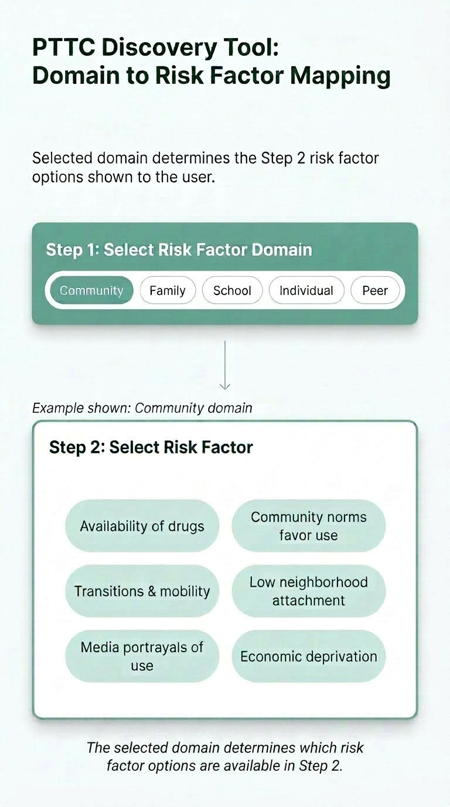
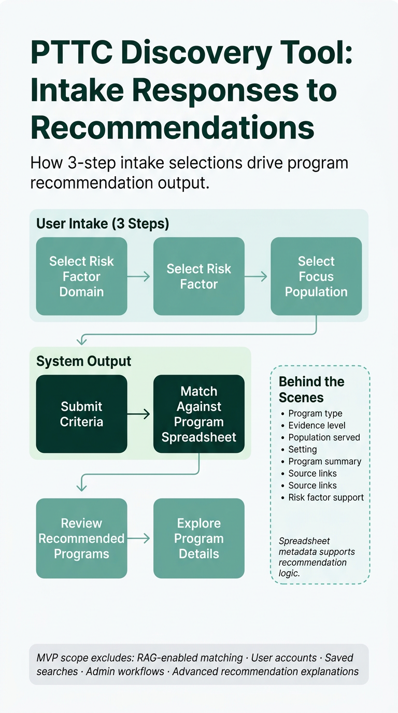

# 🧭 Evidence-Based Program Discovery Workflow Case Study

## Overview

The evidence-based program discovery workflow is a guided intake and recommendation workflow designed to help substance misuse prevention professionals identify relevant evidence-based prevention programs based on risk factor domain, specific risk factor needs, and focus population.

This case study documents my product ownership work for a generalized prevention technology workflow. My work focused on intake flow design, MVP scope control, requirements definition, acceptance criteria, and developer-ready implementation planning.

This repository is a public portfolio case study based on a generalized prevention technology workflow. It has been adapted to remove client-identifying details and does not include private client data, credentials, production secrets, proprietary records, or stakeholder names.

## 🧩 Problem

Prevention professionals often need to identify programs that match specific risk factors, populations, timing considerations, and prevention approaches.

Without a structured intake and recommendation workflow, the discovery process can become:

• Manual  
• Inconsistent  
• Hard to scale  
• Difficult for newer prevention professionals to navigate  
• Dependent on deep subject-matter expertise  

The product challenge was to turn complex prevention knowledge into a guided digital workflow that could help users move from broad program needs to more relevant recommendations.

## 💡 Why This Matters

Prevention technology workflows support the substance misuse prevention field by helping teams organize tools, training, technical assistance, and prevention science resources into clearer decision pathways.

A better discovery workflow helps prevention professionals:

• Navigate evidence-based program options more efficiently  
• Connect program selection to prevention science concepts  
• Reduce guesswork during early planning  
• Improve consistency in how needs are translated into program recommendations  
• Support the next generation of prevention professionals with clearer decision pathways  

## 👥 Users

Primary users include:

• Substance misuse prevention professionals  
• Training and technical assistance providers  
• Program planners  
• Public health and prevention stakeholders  
• Newer professionals entering the prevention field  

## 🎯 My Role

I led product ownership and product operations work, including:

• Product discovery  
• Intake flow design  
• MVP scope definition  
• User story development  
• Acceptance criteria  
• Jira-ready ticket planning  
• Stakeholder translation  
• Budget-conscious delivery planning  
• Developer handoff  

My focus was to translate complex prevention concepts into a clear, buildable product experience that could be implemented within practical budget and delivery constraints.

## 🚀 Product Goals

The product was designed to:

• Help users move from broad prevention needs to relevant program recommendations  
• Translate prevention framework concepts into a clear digital intake experience  
• Reduce friction for users who do not already know which evidence-based programs to search for  
• Protect MVP scope while leaving room for future recommendation enhancements  
• Give developers structured requirements and acceptance criteria for implementation  

## 🛠️ MVP Scope

The MVP focused on a 3-step guided intake flow and recommendation logic based on:

• Risk Factor Domain  
• Risk Factor  
• Focus Population  

Additional spreadsheet fields were used behind the scenes to support recommendation logic and improve output relevance without requiring users to manually filter every available program attribute.

The goal was not to overbuild the first version. The MVP needed to prove the intake logic, user flow, and recommendation structure before expanding into more advanced features.

## 📊 Product Logic Diagrams

### Domain to Risk Factor Mapping

The approved MVP uses a guided intake process where the selected Risk Factor Domain determines which Risk Factor options are presented to the user.

This approach reduces cognitive load, improves usability, and helps prevention professionals navigate large program datasets more efficiently.

### Intake Responses to Recommendations

This diagram shows how the approved 3-step intake captures user responses and uses spreadsheet-supported metadata behind the scenes to generate relevant program recommendations.

## 🔮 Future Scope

Future enhancements may include:

• RAG-enabled recommendation logic  
• Expanded program database support  
• Admin review workflows  
• Program registry updates  
• Analytics on recommendation usage  
• Improved recommendation explanations  
• User feedback loops to improve matching quality  

## 🧠 Key Product Decisions

### 1. Structure the intake around prevention logic

Instead of building a generic search form, the intake was designed around how prevention professionals think about program fit.

### 2. Keep the user-facing intake lightweight

The MVP used a 3-step intake so users could provide the highest-value decision inputs without being overwhelmed by every available spreadsheet field.

### 3. Separate MVP needs from future enhancements

Advanced recommendation features were intentionally deferred so the first build could stay focused, usable, and budget-conscious.

### 4. Prioritize developer-ready requirements

Each product decision needed to be translated into clear requirements, acceptance criteria, and implementation guidance to reduce ambiguity during the build.

### 5. Protect user clarity

The workflow needed to guide users through complex prevention concepts without overwhelming them.

## 📁 Repository Contents

This repository is a public portfolio case study based on a generalized prevention technology workflow. It has been adapted to remove client-identifying details and does not include private client data, credentials, production secrets, proprietary records, or stakeholder names.

Current documentation structure:

• `README.md`  
• `/docs/requirements.md`  
• `/docs/acceptance-criteria.md`  
• `pttc-domain-risk-factor-mapping.png`  
• `pttc-intake-responses-to-recommendations.png`  

## ✅ Outcome

The work created a clearer MVP product direction, stronger developer handoff materials, and a more structured path for turning prevention expertise into a usable digital product.

Key outcomes included:

• Clearer intake structure  
• Reduced scope ambiguity  
• Stronger MVP boundaries  
• Developer-ready requirements  
• More focused product delivery planning  
• A foundation for future AI-assisted or RAG-enabled recommendations  

## 🔁 Future Iterations

If continuing the product, the next priorities would be:

• Add visual workflow diagrams and user stories for each intake step  
• Create wireframes or screenshots to support stakeholder review  
• Define a future-state roadmap for RAG-enabled recommendations  
• Add user feedback loops to improve recommendation quality  
• Create an admin review workflow for program database updates  

## 🧰 Skills Demonstrated

• Product Ownership  
• MVP Scope Control  
• Intake Flow Design  
• Requirements Definition  
• Acceptance Criteria  
• Stakeholder Translation  
• Developer Handoff  
• Prevention Technology Product Strategy  
• Budget-Conscious Product Delivery  
• AI-Ready Product Planning
